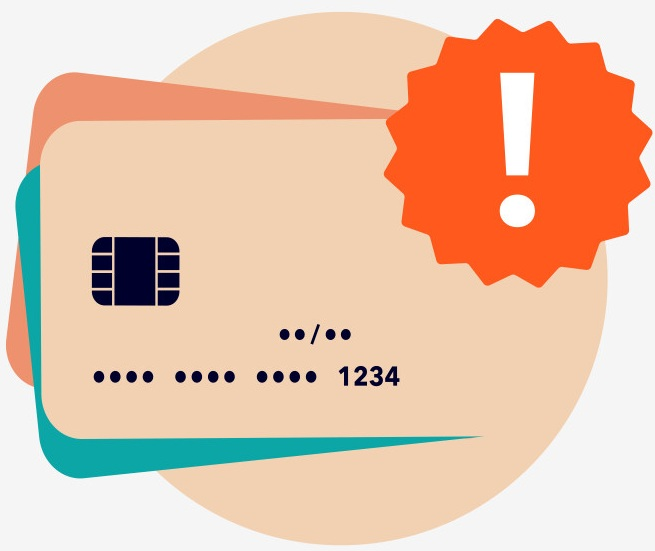

# Credit Card Fraud Detection

Credit Card Fraud Detection is a project that analyzes a highly imbalanced credit card transaction dataset to detect fraudulent activities. The data contains 284,807 transactions made by European cardholders in September 2013, including 492 fraud cases (0.172%).

All features (V1–V28) are results of a PCA transformation, except for Time (seconds elapsed since the first transaction) and Amount (transaction value). The target variable Class indicates whether a transaction is fraudulent (1) or legitimate (0).

The project focuses on exploratory data analysis (EDA), data preprocessing, and fraud detection modeling using various machine learning techniques. 

## Dataset Content
[Kaggle](https://www.kaggle.com/datasets/mlg-ulb/creditcardfraud).

## Business Requirements
The main business requirement of this project is to develop a reliable data-driven system for detecting fraudulent credit card transactions, aiming to minimize financial losses and protect customers from unauthorized charges. The goal is to analyze transaction patterns and identify key indicators that distinguish fraudulent from legitimate activities using historical data. The project seeks to answer critical business questions such as how fraud can be detected early, which features have the most influence, and how to reduce false positives that inconvenience genuine customers. Success will be measured through metrics like high recall, precision, and Area Under the Precision-Recall Curve (AUPRC), ensuring both effective detection and operational efficiency. The expected outcome is an accurate fraud detection model supported by clear insights and visualizations that can guide better decision-making and improve transaction monitoring systems.

## Hypothesis and how to validate?
* List here your project hypothesis(es) and how you envision validating it (them) 

## Project Plan
**High-Level Steps for the Analysis**
- Explore the credit card transactions dataset to understand its structure, features, and class imbalance.
- Perform exploratory data analysis (EDA) to identify trends, correlations, and differences between fraudulent and legitimate transactions.
- Conduct data preprocessing, including scaling numeric features (Amount, Time) and addressing class imbalance using resampling techniques such as undersampling, oversampling, or SMOTE.
- Split the dataset into training and testing sets to ensure unbiased model evaluation.
- Apply machine learning models such as Logistic Regression, Random Forest, and Gradient Boosting to classify transactions.
- Evaluate model performance using Precision, Recall, F1-score, and Area Under the Precision-Recall Curve (AUPRC).
- Visualize results and generate insights to interpret model behavior and support business decision-making.

**Data Management**
- Maintain data integrity throughout all stages of the workflow through consistent preprocessing and validation steps.
- Keep a clean and reproducible pipeline by documenting data transformations and versioning scripts.
- Use appropriate scaling and normalization methods to enhance model performance.
- Handle class imbalance with sampling techniques to prevent bias toward the majority class.
- Store processed datasets securely and track model iterations for transparency and reproducibility.

**Research Methodology Justification**
- Use supervised machine learning algorithms suitable for binary classification and imbalanced datasets.
- Focus on Precision-Recall metrics instead of accuracy to better evaluate model effectiveness on rare events.
- Work directly with PCA-transformed features due to confidentiality restrictions and the dataset’s preprocessed nature.
- Prioritize interpretable models and clear visualizations to provide actionable business insights.
- Follow standard data science workflow practices to ensure consistency, scalability, and clarity throughout the analysis.

## The rationale to map the business requirements to the Data Visualisations
* List your business requirements and a rationale to map them to the Data Visualisations

## Analysis techniques used
* List the data analysis methods used and explain limitations or alternative approaches.
* How did you structure the data analysis techniques. Justify your response.
* Did the data limit you, and did you use an alternative approach to meet these challenges?
* How did you use generative AI tools to help with ideation, design thinking and code optimisation?

## Ethical considerations
* Were there any data privacy, bias or fairness issues with the data?
* How did you overcome any legal or societal issues?

## Dashboard Design
* List all dashboard pages and their content, either blocks of information or widgets, like buttons, checkboxes, images, or any other item that your dashboard library supports.
* Later, during the project development, you may revisit your dashboard plan to update a given feature (for example, at the beginning of the project you were confident you would use a given plot to display an insight but subsequently you used another plot type).
* How were data insights communicated to technical and non-technical audiences?
* Explain how the dashboard was designed to communicate complex data insights to different audiences. 

## Unfixed Bugs
* Please mention unfixed bugs and why they were not fixed. This section should include shortcomings of the frameworks or technologies used. Although time can be a significant variable to consider, paucity of time and difficulty understanding implementation are not valid reasons to leave bugs unfixed.
* Did you recognise gaps in your knowledge, and how did you address them?
* If applicable, include evidence of feedback received (from peers or instructors) and how it improved your approach or understanding.

## Development Roadmap
* What challenges did you face, and what strategies were used to overcome these challenges?
* What new skills or tools do you plan to learn next based on your project experience? 

## Deployment
### Heroku

* The App live link is: https://YOUR_APP_NAME.herokuapp.com/ 
* Set the runtime.txt Python version to a [Heroku-20](https://devcenter.heroku.com/articles/python-support#supported-runtimes) stack currently supported version.
* The project was deployed to Heroku using the following steps.

1. Log in to Heroku and create an App
2. From the Deploy tab, select GitHub as the deployment method.
3. Select your repository name and click Search. Once it is found, click Connect.
4. Select the branch you want to deploy, then click Deploy Branch.
5. The deployment process should happen smoothly if all deployment files are fully functional. Click now the button Open App on the top of the page to access your App.
6. If the slug size is too large then add large files not required for the app to the .slugignore file.

## Main Data Analysis Libraries
* Here you should list the libraries you used in the project and provide an example(s) of how you used these libraries.

## Credits 

- Cover image downloaded from https://www.vectorstock.com/royalty-free-vector/fraud-detection-icon-guard-against-bank-card-vector-50566859

* In this section, you need to reference where you got your content, media and extra help from. It is common practice to use code from other repositories and tutorials, however, it is important to be very specific about these sources to avoid plagiarism. 
* You can break the credits section up into Content and Media, depending on what you have included in your project. 

### Content 

- The text for the Home page was taken from Wikipedia Article A
- Instructions on how to implement form validation on the Sign-Up page was taken from [Specific YouTube Tutorial](https://www.youtube.com/)
- The icons in the footer were taken from [Font Awesome](https://fontawesome.com/)

### Media

- The photos used on the home and sign-up page are from This Open-Source site
- The images used for the gallery page were taken from this other open-source site

## Acknowledgements (optional)
* Thank the people who provided support through this project.
